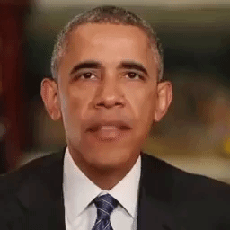
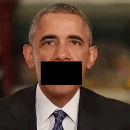
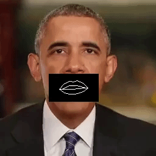

<h1 align=center> ObamaNet : Lip Sync from Audio </h1>


<p align="center">
</a> 
</a>
</a>
</a>
</a>
</p>

### List of Contents

* [Requirements](https://github.com/karanvivekbhargava/obamanet#requirements)
* [Data Extraction](https://github.com/karanvivekbhargava/obamanet#data_extraction)
* [Data Preprocessing](https://github.com/karanvivekbhargava/obamanet#data_preprocessing)
* [Training Different Models](https://github.com/karanvivekbhargava/obamanet#training_different_models)
* [Pretrained Model](https://github.com/karanvivekbhargava/obamanet#pretrained_model)
* [How to run an example](https://github.com/karanvivekbhargava/obamanet#how_to_run_an_example)
* [Citations](https://github.com/karanvivekbhargava/obamanet#citations)
* [FAQs](https://github.com/karanvivekbhargava/obamanet#faqs)
	

### Requirements

You may install the requirements by running the following command
```
sudo pip3 install -r requirements.txt
```

The project is built for python 3.5 and above. The other libraries are listed below
* OpenCV (`sudo pip3 install opencv-contrib-python`)
* Dlib (`sudo pip3 install dlib`) with [this](http://dlib.net/files/shape_predictor_68_face_landmarks.dat.bz2) file unzipped in the data folder
* Python Speech Features (`sudo pip3 install python-speech-features`)

For a complete list refer to `requirements.txt` file.

I used the tools below to extract and manipulate the data:
* ffmpeg (`sudo apt-get install ffmpeg`)
* [YouTube-dl](https://github.com/rg3/youtube-dl#video-selection)

### Data Extraction
---
I extracted the data from youtube using youtube-dl. It's perhaps the best downloader for youtube on linux. Commands for extracting particular streams are given below.

* Subtitle Extraction
```
youtube-dl --sub-lang en --skip-download --write-sub --output '~/obamanet/data/captions/%(autonumber)s.%(ext)s' --batch-file ~/obamanet/data/obama_addresses.txt --ignore-config
```
* Video Extraction
```
youtube-dl --batch-file ~/obamanet/data/obama_addresses.txt -o '~/obamanet/data/videos/%(autonumber)s.%(ext)s' -f "best[height=720]" --autonumber-start 1
```
(Videos not available in 720p: 165)
* Video to Audio Conversion
```
python3 vid2wav.py
```
* Video to Images
```
ffmpeg -i 00001.mp4 -r 1/5 -vf scale=-1:720 images/00001-$filename%05d.bmp
```

To convert from BMP format to JPG format, use the following in the directory
```
mogrify -format jpg *.bmp
rm -rf *.bmp
```

Copy the patched images into folder `a` and the cropped images to folder `b`
```
python3 tools/process.py --input_dir a --b_dir b --operation combine --output_dir c
python3 tools/split.py --dir c
```

You may use [this](https://drive.google.com/open?id=1zKip_rlNY2Dk14fzzOHQm03HJNvJTjGT) pretrained model or train pix2pix from scratch using [this](https://drive.google.com/open?id=1sJBp5bYe3XSyE7ys5i7ABORFZctWEQhW) dataset. Unzip the dataset into the [pix2pix](https://github.com/affinelayer/pix2pix-tensorflow) main directory.

```
python3 pix2pix.py --mode train --output_dir output --max_epochs 200 --input_dir c/train/ --which_direction AtoB
```

To run the pix2pix trained model
```
python3 pix2pix.py --mode test --output_dir test_out/ --input_dir c_test/ --checkpoint output/
```

To convert images to video
```
ffmpeg -r 30 -f image2 -s 256x256 -i %d-targets.png -vcodec libx264 -crf 25 ../targets.mp4
```


### Pretrained Model

Link to the pretrained model and a subset of the data is here - [Link](https://drive.google.com/drive/folders/1QDRCWmqr87E3LWmYztqE7cpBZ3fALo-x?usp=sharing)

Download and extract the checkpoints and the data folders into the repository. The file structure should look as shown below.

```
obamanet
|
└─ data
|   | audios
|   | a2key_data
|   ...
|
└─ checkpoints
|   | output
|   | model.h5
|   ...
└─ train.py
└─ run.py
└─ run.sh
...
```


### Running sample wav file

Run the following commands
```
bash run.sh <relative_path_to_audio_wav_file>
```
Example:
```
bash run.sh data/audios/karan.wav
```
Feel free to experiment with different voices. However, the result will depend on how close your voice is to the subject we trained on.


### Citation
---
If you use this code for your research, please cite the paper this code is based on: [ObamaNet: Photo-realistic lip-sync from text](https://arxiv.org/pdf/1801.01442) and also the amazing repository of pix2pix by affinelayer.
```
Cite as arXiv:1801.01442v1 [cs.CV]
```


### FAQs

* [What is target delay for RNN/LSTM?](https://stats.stackexchange.com/questions/154814/what-is-target-delay-in-the-context-of-rnn-lstm)
* [Keras implementation of time delayed LSTM?](https://github.com/keras-team/keras/issues/6063)
* [Another link for the above](https://github.com/joncox123/Cortexsys/issues/4)